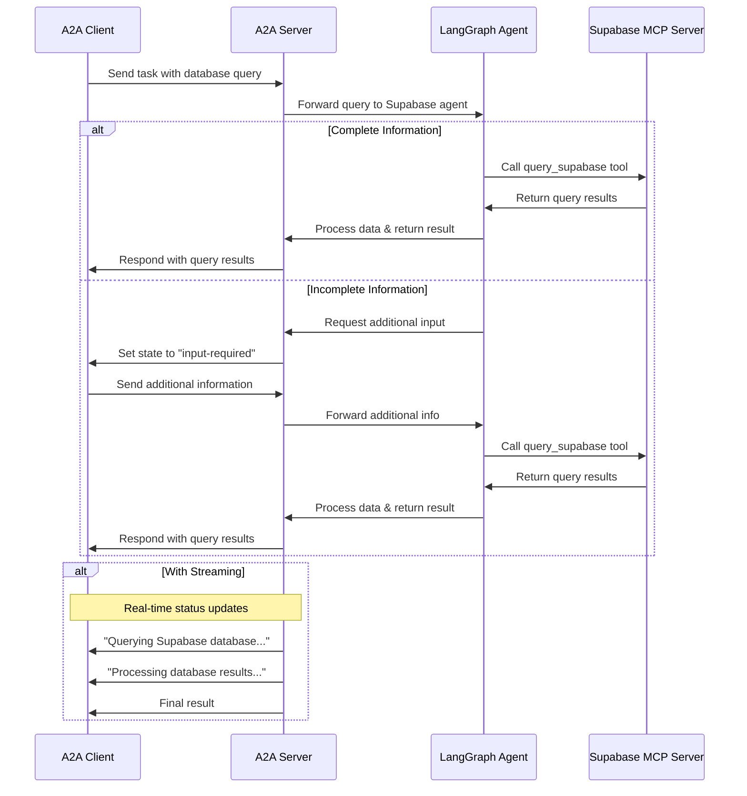

# LangGraph Supabase Agent with A2A Protocol and MCP Tools

This sample demonstrates a Supabase database query agent built with [LangGraph](https://langchain-ai.github.io/langgraph/) and exposed through the A2A protocol. It uses MCP (Model Context Protocol) tools to interact with an HTTP Supabase MCP server.

## How It Works

This agent uses LangGraph with LLM (for example Azure OpenAI) to query Supabase databases through MCP tools. The A2A protocol enables standardized interaction with the agent, allowing clients to send requests and receive real-time updates.



## Key Features

- **Multi-turn Conversations**: Agent can request additional information when needed
- **Real-time Streaming**: Provides status updates during processing
- **Push Notifications**: Support for webhook-based notifications
- **Conversational Memory**: Maintains context across interactions
- **Supabase MCP Integration**: Uses MCP tools to query Supabase databases via HTTP

## Prerequisites

- Python 3.12 or higher
- [UV](https://docs.astral.sh/uv/)
- Access to an LLM and API Key (Azure OpenAI)
- A running Supabase MCP HTTP server

## Setup & Running

1. Navigate to the samples directory:

   ```bash
   cd samples/python/agents/langgraph_supabase
   ```

2. Create an environment file with your API keys and MCP server URL:

   ```bash
   # Azure OpenAI Configuration
   echo "AZURE_OPENAI_API_KEY=your_api_key_here" > .env
   echo "AZURE_OPENAI_API_VERSION=2024-02-15-preview" >> .env
   echo "AZURE_OPENAI_DEPLOYMENT_NAME=your_deployment_name" >> .env
   echo "AZURE_OPENAI_ENDPOINT=https://your-resource.openai.azure.com/" >> .env
   
   # Supabase MCP Server URL
   echo "SUPABASE_MCP_SERVER_URL=http://localhost:3000" >> .env
   ```

3. Run the agent:

   ```bash
   # Basic run on default port 10001
   uv run app

   # On custom host/port
   uv run app --host 0.0.0.0 --port 8080
   ```

## Build Container Image

Agent can also be built using a container file.

1. Navigate to the `samples/python/agents/langgraph_supabase` directory:

   ```bash
   cd samples/python/agents/langgraph_supabase
   ```

2. Build the container file

    ```bash
    podman build . -t langgraph-supabase-a2a-server
    ```

> [!Tip]  
> Podman is a drop-in replacement for `docker` which can also be used in these commands.

3. Run your container

    ```bash
    podman run -p 10001:10001 \
      -e AZURE_OPENAI_API_KEY=your_api_key_here \
      -e AZURE_OPENAI_ENDPOINT=your_endpoint \
      -e SUPABASE_MCP_SERVER_URL=http://your-mcp-server:3000 \
      langgraph-supabase-a2a-server
    ```

> [!Important]
> * **Access URL:** You must access the A2A client through the URL `0.0.0.0:10001`. Using `localhost` will not work.
> * **Hostname Override:** If you're deploying to an environment where the hostname is defined differently outside the container, use the `HOST_OVERRIDE` environment variable to set the expected hostname on the Agent Card. This ensures proper communication with your client application.

## Technical Implementation

- **LangGraph ReAct Agent**: Uses the ReAct pattern for reasoning and tool usage
- **MCP Tool Integration**: Connects to HTTP Supabase MCP server for database queries
- **Streaming Support**: Provides incremental updates during processing
- **Checkpoint Memory**: Maintains conversation state between turns
- **Push Notification System**: Webhook-based updates with JWK authentication
- **A2A Protocol Integration**: Full compliance with A2A specifications

## Limitations

- Only supports text-based input/output (no multi-modal support)
- Requires a running Supabase MCP HTTP server
- Memory is session-based and not persisted between server restarts

## Examples

**Synchronous request**

Request:

```
POST http://localhost:10001
Content-Type: application/json

{
    "id": "12113c25-b752-473f-977e-c9ad33cf4f56",
    "jsonrpc": "2.0",
    "method": "message/send",
    "params": {
        "message": {
            "kind": "message",
            "messageId": "120ec73f93024993becf954d03a672bc",
            "parts": [
                {
                    "kind": "text",
                    "text": "What data is in the users table?"
                }
            ],
            "role": "user"
        }
    }
}
```

Response:

```
{
    "id": "12113c25-b752-473f-977e-c9ad33cf4f56",
    "jsonrpc": "2.0",
    "result": {
        "artifacts": [
            {
                "artifactId": "08373241-a745-4abe-a78b-9ca60882bcc6",
                "name": "supabase_query_result",
                "parts": [
                    {
                        "kind": "text",
                        "text": "The users table contains 5 records with fields: id, name, email, created_at."
                    }
                ]
            }
        ],
        "contextId": "e329f200-eaf4-4ae9-a8ef-a33cf9485367",
        "history": [
            {
                "contextId": "e329f200-eaf4-4ae9-a8ef-a33cf9485367",
                "kind": "message",
                "messageId": "120ec73f93024993becf954d03a672bc",
                "parts": [
                    {
                        "kind": "text",
                        "text": "What data is in the users table?"
                    }
                ],
                "role": "user",
                "taskId": "58124b63-dd3b-46b8-bf1d-1cc1aefd1c8f"
            },
            {
                "contextId": "e329f200-eaf4-4ae9-a8ef-a33cf9485367",
                "kind": "message",
                "messageId": "d8b4d7de-709f-40f7-ae0c-fd6ee398a2bf",
                "parts": [
                    {
                        "kind": "text",
                        "text": "Querying Supabase database..."
                    }
                ],
                "role": "agent",
                "taskId": "58124b63-dd3b-46b8-bf1d-1cc1aefd1c8f"
            },
            {
                "contextId": "e329f200-eaf4-4ae9-a8ef-a33cf9485367",
                "kind": "message",
                "messageId": "ee0cb3b6-c3d6-4316-8d58-315c437a2a77",
                "parts": [
                    {
                        "kind": "text",
                        "text": "Processing database results..."
                    }
                ],
                "role": "agent",
                "taskId": "58124b63-dd3b-46b8-bf1d-1cc1aefd1c8f"
            }
        ],
        "id": "58124b63-dd3b-46b8-bf1d-1cc1aefd1c8f",
        "kind": "task",
        "status": {
            "state": "completed"
        }
    }
}
```

## Learn More

- [A2A Protocol Documentation](https://a2a-protocol.org/)
- [LangGraph Documentation](https://langchain-ai.github.io/langgraph/)
- [Model Context Protocol (MCP)](https://modelcontextprotocol.io/)
- [Supabase Documentation](https://supabase.com/docs)


## Disclaimer
Important: The sample code provided is for demonstration purposes and illustrates the mechanics of the Agent-to-Agent (A2A) protocol. When building production applications, it is critical to treat any agent operating outside of your direct control as a potentially untrusted entity.

All data received from an external agent—including but not limited to its AgentCard, messages, artifacts, and task statuses—should be handled as untrusted input. For example, a malicious agent could provide an AgentCard containing crafted data in its fields (e.g., description, name, skills.description). If this data is used without sanitization to construct prompts for a Large Language Model (LLM), it could expose your application to prompt injection attacks.  Failure to properly validate and sanitize this data before use can introduce security vulnerabilities into your application.

Developers are responsible for implementing appropriate security measures, such as input validation and secure handling of credentials to protect their systems and users.
